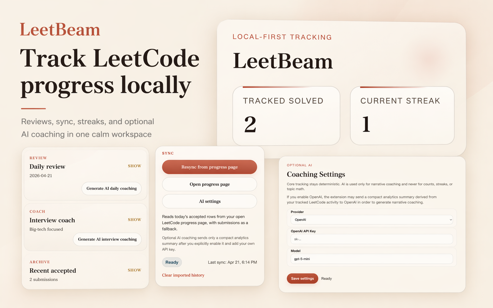
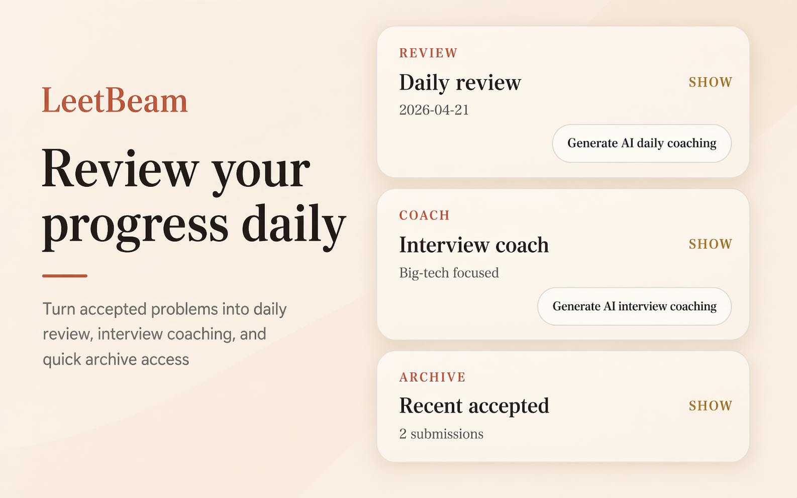
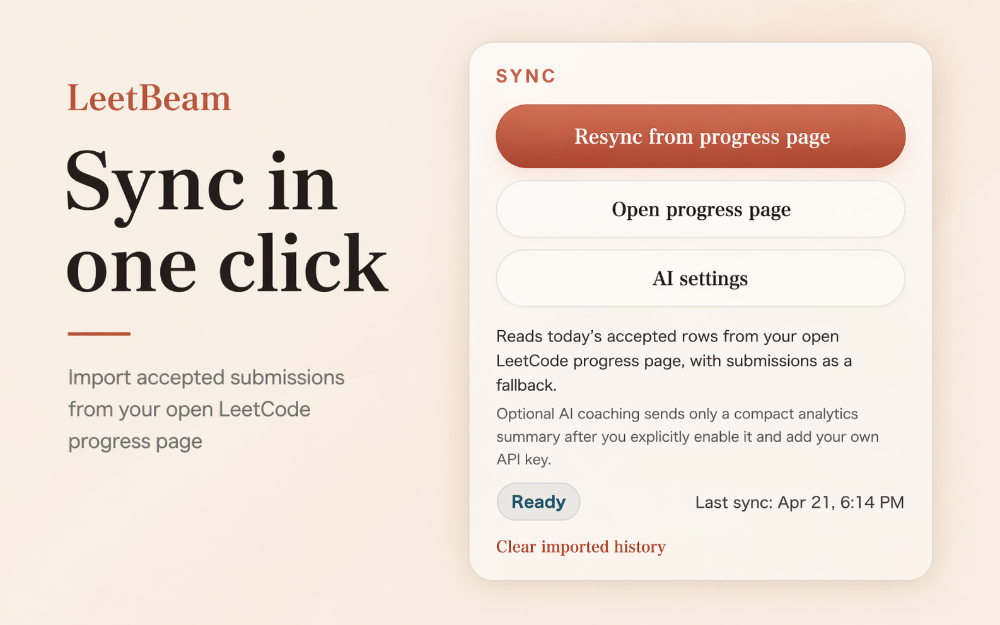
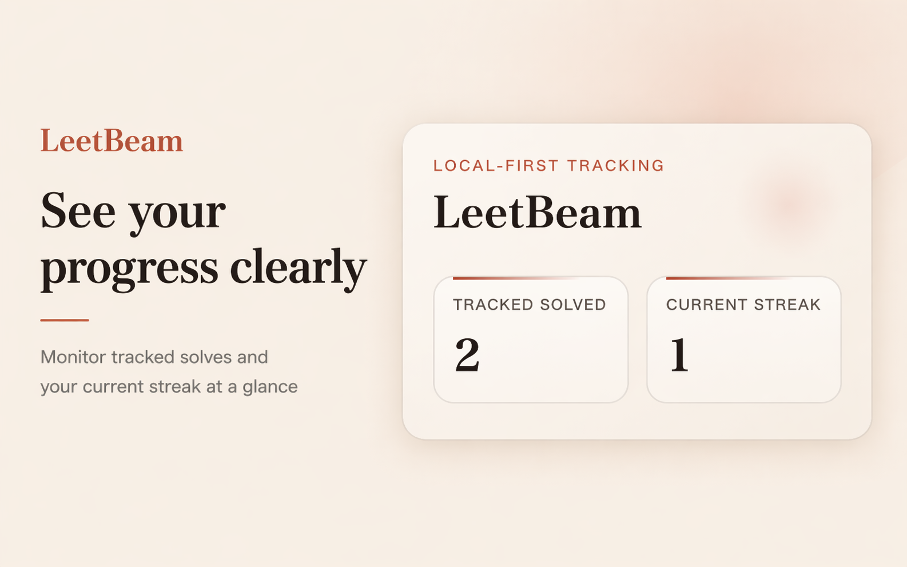
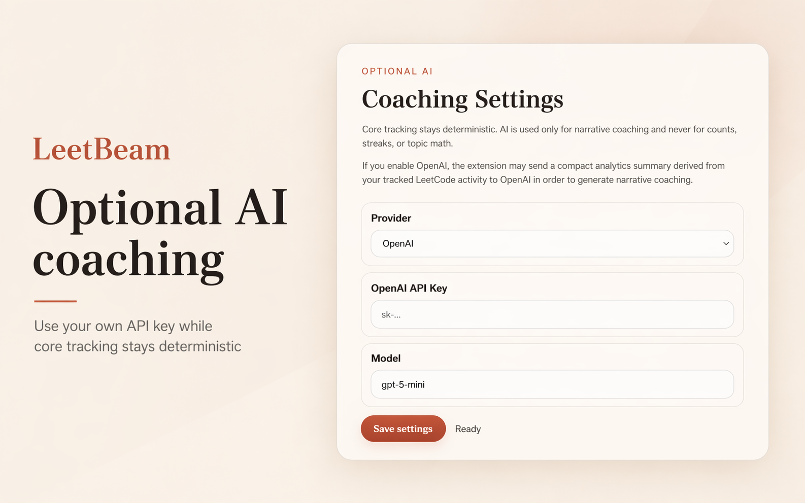

# LeetBeam

A local-first Chrome Manifest V3 extension that watches LeetCode problem pages, records solve timing, captures Accepted submissions when possible, stores everything in `chrome.storage.local`, and shows progress plus deterministic feedback in the popup. Optional AI coaching can be enabled separately for narrative summaries only.

## Screenshots

### Full Product Overview



### Daily Review



### Progress Sync



### Dashboard



### Optional AI Settings



## File Tree

```text
leetcode-progress-tracker-mvp/
├── manifest.json
├── PRIVACY_POLICY.md
├── README.md
├── assets/
├── store/
└── src/
    ├── background/
    │   └── service-worker.js
    ├── content/
    │   └── content-script.js
    ├── lib/
    │   ├── feedback-engine.js
    │   ├── site-parser.js
    │   ├── storage.js
    │   └── utils.js
    ├── popup/
    │   ├── popup.css
    │   ├── popup.html
    │   └── popup.js
    ├── options/
    │   ├── options.css
    │   ├── options.html
    │   └── options.js
    └── providers/
        └── ai-provider.js
```

## How It Works

### Content script

- Runs on `https://leetcode.com/problems/*`.
- Shows a floating LeetBeam timer on problem pages and lets users start timing real solves with less friction than LeetCode's built-in timer.
- Watches page mutations and looks for a conservative Accepted signal in visible submission UI.
- Extracts the current problem title, slug, difficulty, tags, language, and editor code when the page DOM exposes it.
- Automatically stops the timer only when the submission result is actually Accepted.
- Sends a single normalized submission payload to the background worker.

### Background service worker

- Receives accepted-submission events from the content script.
- Builds a submission record, attaches solve duration when a timer was active, dedupes near-identical accepted solutions, runs local rule-based feedback, optionally calls the AI provider interface for narrative coaching, and writes the result into local storage.
- Serves popup data through runtime messaging.

### Storage

- Uses a single local state object in `chrome.storage.local`.
- Keeps:
  - `submissions`: accepted submission records
  - `activeTimer`: current in-progress solve timer
  - `feedbackBySubmissionId`: latest feedback per stored submission
  - `aggregates`: total solved, streak, solved slugs, last accepted timestamp
  - `settings`: AI provider configuration and optional model settings
  - `aiCoaching`: cached optional AI-generated coaching records keyed to deterministic analytics snapshots

### Popup

- Reads precomputed local state from the background worker.
- Shows total solved tracked by the extension, current streak, and recent accepted submissions with feedback cards and recorded solve durations.
- Still works with no AI provider configured because the rule-based engine and analytics always run locally.
- Allows users to open AI settings and optionally generate AI daily/interview coaching after configuring their own OpenAI API key.

### Rule-based feedback engine

- Detects:
  - generic or vague variable names
  - excessive nesting depth
  - long function or class blocks
  - likely missing edge-case guards when heuristics suggest them
- Falls back gracefully with metadata-only feedback if code extraction is unavailable.

### AI provider stub

- `src/providers/ai-provider.js` exposes a stable provider interface.
- The current implementation supports a `stub` provider and an optional `openai` provider for narrative coaching.
- Core analytics remain deterministic even when AI is enabled.

## Setup

1. Open Chrome and go to `chrome://extensions`.
2. Enable **Developer mode**.
3. Click **Load unpacked**.
4. Select the `leetcode-progress-tracker-mvp` folder.
5. Open a LeetCode problem page such as `https://leetcode.com/problems/two-sum/`.
6. Start the floating timer when you begin solving.
7. Submit a solution until LeetCode shows an **Accepted** result.
8. Open the extension popup to view tracked totals, streak, recent submissions, solve time, and local feedback.

## Optional AI Coaching

AI coaching is disabled by default.

If you want narrative AI coaching:

1. Open the popup.
2. Click `AI settings`.
3. Choose `OpenAI`.
4. Add your own OpenAI API key.
5. Optionally adjust the model name.
6. Save settings.
7. Return to the popup and use:
   - `Generate AI daily coaching`
   - `Generate AI interview coaching`

Important:

- AI is optional.
- Counts, streaks, and topic math remain deterministic and local.
- AI receives compact analytics summaries for coaching only when you explicitly enable it.

## Chrome Web Store Prep

Files included for submission prep:

- Privacy policy draft: [PRIVACY_POLICY.md](/Users/james/Projects_Labs/leetcode-progress-tracker-mvp/PRIVACY_POLICY.md)
- Listing copy: [STORE_LISTING.md](/Users/james/Projects_Labs/leetcode-progress-tracker-mvp/store/STORE_LISTING.md)
- Publishing checklist: [PUBLISHING_CHECKLIST.md](/Users/james/Projects_Labs/leetcode-progress-tracker-mvp/store/PUBLISHING_CHECKLIST.md)
- Store submission fields guide: [STORE_SUBMISSION_FIELDS.md](/Users/james/Projects_Labs/leetcode-progress-tracker-mvp/store/STORE_SUBMISSION_FIELDS.md)
- Screenshot captions: [SCREENSHOT_CAPTIONS.md](/Users/james/Projects_Labs/leetcode-progress-tracker-mvp/store/SCREENSHOT_CAPTIONS.md)
- Support/contact template: [SUPPORT.md](/Users/james/Projects_Labs/leetcode-progress-tracker-mvp/store/SUPPORT.md)
- URL placeholder template: [PROJECT_URLS_TEMPLATE.md](/Users/james/Projects_Labs/leetcode-progress-tracker-mvp/store/PROJECT_URLS_TEMPLATE.md)
- Changelog: [CHANGELOG.md](/Users/james/Projects_Labs/leetcode-progress-tracker-mvp/CHANGELOG.md)

You still need to host the privacy policy publicly before submission.

## Assumptions And Known Limitations

- The extension relies on DOM extraction only. It does not call private or unsupported LeetCode APIs.
- Accepted detection and timer auto-stop are tied to visible submission-result text. If LeetCode significantly changes its UI, selectors may need updating.
- Monaco-based code extraction depends on editor text being present in the live DOM. Some editor states may expose only visible lines or no readable code at all.
- Deduplication treats the same problem, language, and code hash as one stored accepted submission. Re-accepting identical code will usually not create a second record.
- The streak is based on unique solve days tracked by this extension only, not the user’s full LeetCode history.
- The rule-based feedback is heuristic and intentionally lightweight. It is useful for nudges, not for precise static analysis.
- The optional OpenAI API key is currently stored in extension local storage for convenience. This is acceptable for personal use, but you may want a stronger secrets architecture for a larger-scale production release.

## Packaging

If you want a simple release zip for upload or handoff, run:

```bash
./scripts/package-release.sh
```

That script creates a clean zip in `dist/`.

## Next 5 Improvements

1. Add pause and resume plus idle-time handling for the solve timer.
2. Track richer solve attempts such as run counts, failed submits, and hint usage.
3. Show per-language, per-difficulty, and per-topic timing breakdowns in the popup.
4. Add export and import for local history so tracked progress survives browser profile changes.
5. Add a stronger production-grade secret handling approach for user-supplied model credentials.
